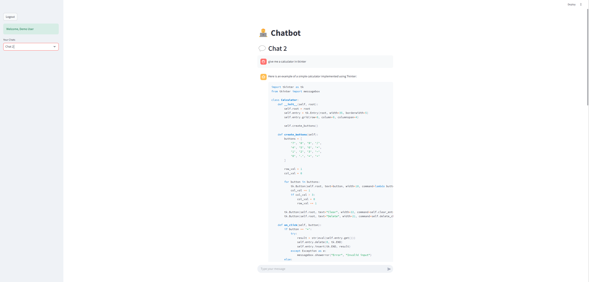

# 🤖 local_chatbot_lmstudio

A privacy-first, aesthetically pleasing chatbot interface built with **Streamlit**, powered by locally hosted LLMs via **LM Studio**. It features full user authentication, chat history management, and multi-session support — all running **100% locally** with no internet dependency.

---

## 📌 Key Features

- 🌐 **Local LLM Support** — Works with any GGUF-compatible model served via [LM Studio](https://lmstudio.ai).
- 🧑‍💼 **User Authentication** — Secure login system via `streamlit_authenticator`.
- 💬 **Chat History** — All conversations stored per user in a local SQLite database.
- 🗂️ **Multi-Chat Support** — Easily switch between existing chats or start new ones.
- 🧠 **LangChain Integration** — Handles message history and LLM response generation.
- 💻 **Streamlit UI** — Simple, beautiful, and fully functional out of the box.

---

## 🛠️ Stack Used

| Layer        | Tech                     |
|--------------|--------------------------|
| Frontend     | [Streamlit](https://streamlit.io) |
| Backend      | Python, [SQLAlchemy](https://www.sqlalchemy.org/) |
| LLM Interface| [LangChain](https://www.langchain.com/) + LM Studio |
| Auth System  | [streamlit_authenticator](https://github.com/mkhorasani/Streamlit-Authenticator) |
| Database     | SQLite                   |

---

## 🔧 Setup Instructions

### 1. Clone the Repository

```bash
git clone https://github.com/yourusername/local_chatbot_lmstudio.git
cd local_chatbot_lmstudio
```

### 2. Create Virtual Environment

```bash
python -m venv venv
source venv/bin/activate  # or venv\Scripts\activate on Windows
```

### 3. Install Dependencies

```bash
pip install -r requirements.txt
```

### 4. Run LM Studio

- Download LM Studio from: https://lmstudio.ai
- Load any GGUF model (e.g., Mistral, TinyLlama, etc.)
- Start the LM Studio server (copy the base URL, usually `http://localhost:1234/v1`)

### 5. Launch the App

```bash
streamlit run app.py
```

The app will be available at: [http://localhost:8501](http://localhost:8501)

---

## 📂 Folder Structure

```
📁 local_chatbot_lmstudio/
├── app.py                 # Main Streamlit app
├── chatbot.db             # SQLite DB (auto-created on first run)
├── requirements.txt       # Python dependencies
├── README.md              # This file
└── ...
```

---

## 🧪 Demo Credentials

```text
Username: demo
Password: password
```

---

## ✅ Roadmap

- [x] User login and session management
- [x] SQLite-backed chat history
- [x] Multi-chat dropdown with new chat creation
- [x] LM Studio LLM support
- [ ] UI/UX polish and theme toggling

---

## 📃 License

This project is licensed under the MIT License. Feel free to use, modify, and distribute.

---

## 🙏 Acknowledgements

- [LM Studio](https://lmstudio.ai)
- [LangChain](https://www.langchain.com/)
- [Streamlit Authenticator](https://github.com/mkhorasani/Streamlit-Authenticator)

---

> 💡 This project is ideal for local AI experiments, personal productivity tools, or building internal company bots — all while keeping data **100% private**.
> 
## 📧 **Contact**

For any questions, suggestions, or feedback, please reach out:

- **Email**: [nszeeshankhalid@gmail.com](mailto:nszeeshankhalid@gmail.com)  
- **GitHub**: [https://github.com/manxlr](https://github.com/manxlr)

---

### 🔗 **Links**

- [GitHub Repository](https://github.com/manxlr/local_chatbot_lmstudio)

---

## 💖 **Donations**

If you find this project helpful and would like to support its continued development, you can donate using the following cryptocurrency addresses:

- **Ethereum (ETH)**: `0x23774348bc491Ff70F39c63f39B0e542a59b5B14`  
- **Bitcoin (BTC)**: `bc1qp7wltg8frvecuujjs9f3ck28r0s0h0qzld2fu6`  
- **Dogecoin (DOGE)**: `DTbwxMs4wenN2kUea77rHPQ8nbJrSk4o7D`  

Your support is greatly appreciated and helps maintain and improve open-source projects!
